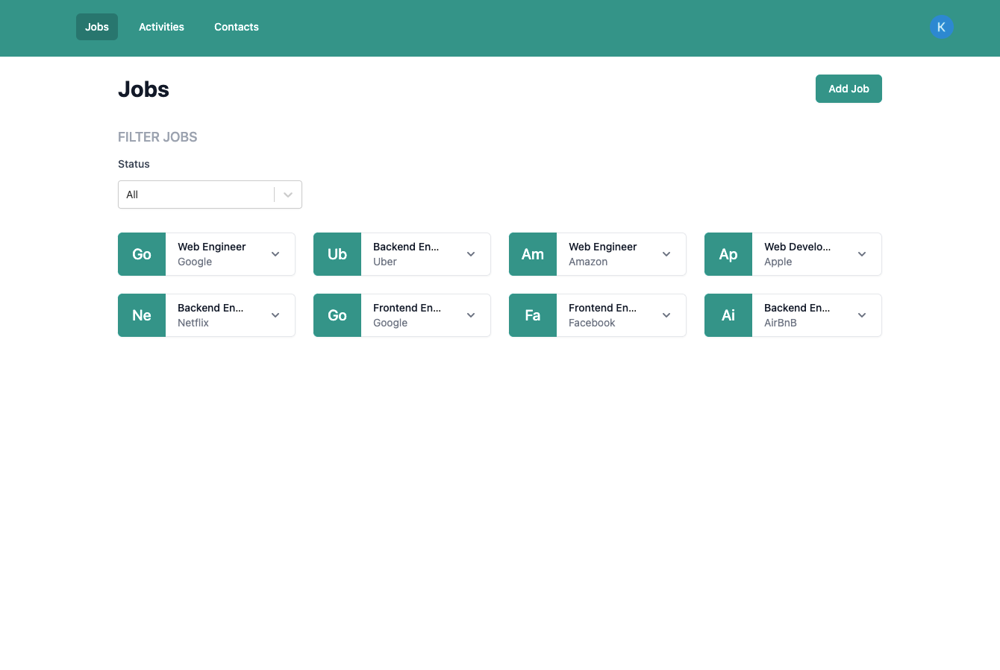
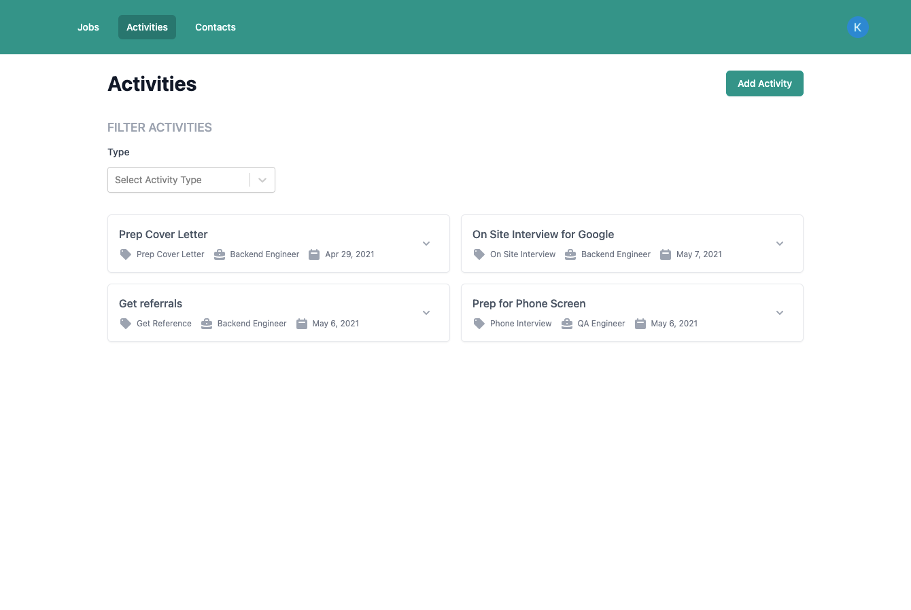
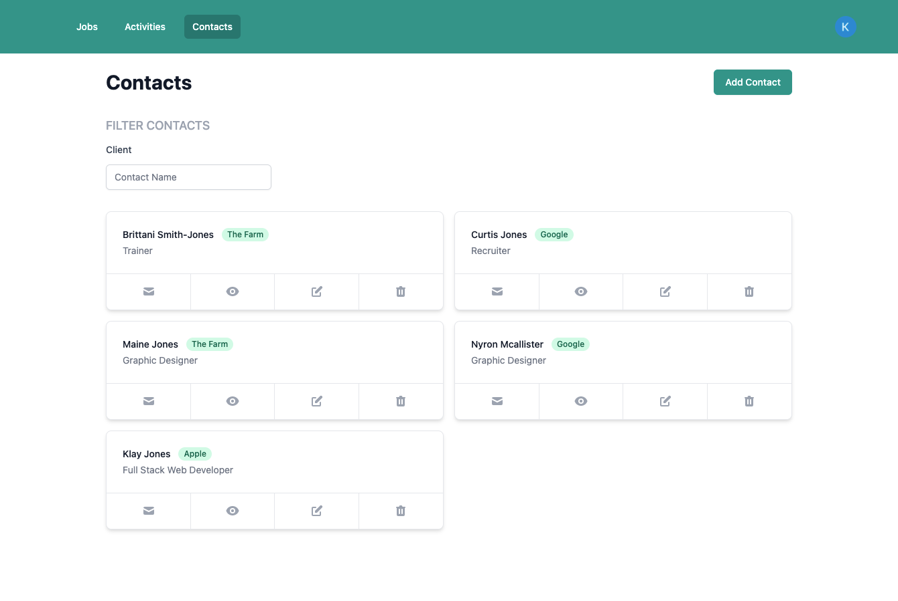

# Seekr  App

---

Serverless Job Application tracker where a user can keep track of jobs, contacts, and activity during their job search.

# Functionality of Application

---

This application allows for creating, reading, updating and deleting items. Each user will only has access to the items that they have created.

# Images

---







# Backend

---

To deploy an application run the following commands:

```bash
cd backend
yarn install
sls deploy -v
```

# Frontend

---

The client Side is built with React using the Next JS Framework. To run the application locally run the following commands:

 

```bash
cd client
yarn install
yarn dev
```

### Environment Variables

Before launching the client side app locally, you will need to create a .env.local file in the root of the folder and add values to the environment variables. I have provided an .env.local.example file with the values. 

```bash
NEXT_PUBLIC_AUTH0_CLIENT_ID=Auth0 Client ID
NEXT_PUBLIC_AUTH0_CLIENT_SECRET=Auth0 Client Secret
NEXT_PUBLIC_AUTH0_DOMAIN=Auth0 Domain
NEXT_PUBLIC_AWS_REGION=AWS Region
NEXT_PUBLIC_AWS_ACCESS_KEY_ID=AWS Access Key
NEXT_PUBLIC_AWS_SECRET_ACCESS_KEY=AWS Secret Access Key
NEXT_PUBLIC_DYNAMODB_TABLE=User table name to save new users in the DynamoDB 
SECRET=JWT Secret

```

## Here is the project live:

[Live Demo](seekr-iota.vercel.app)
